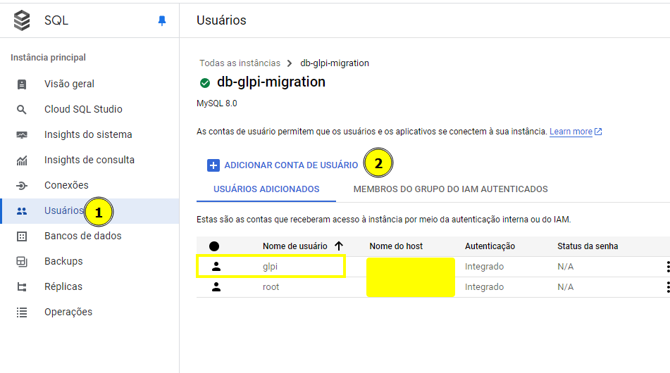
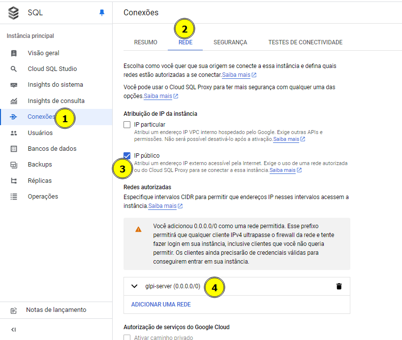
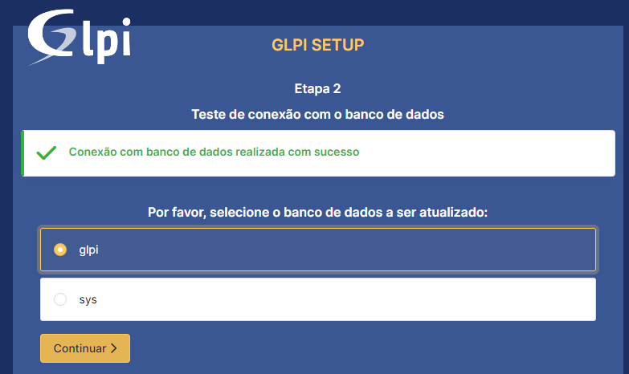
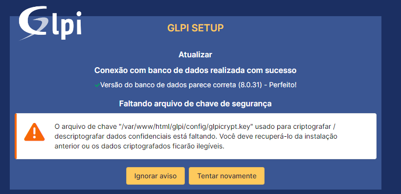
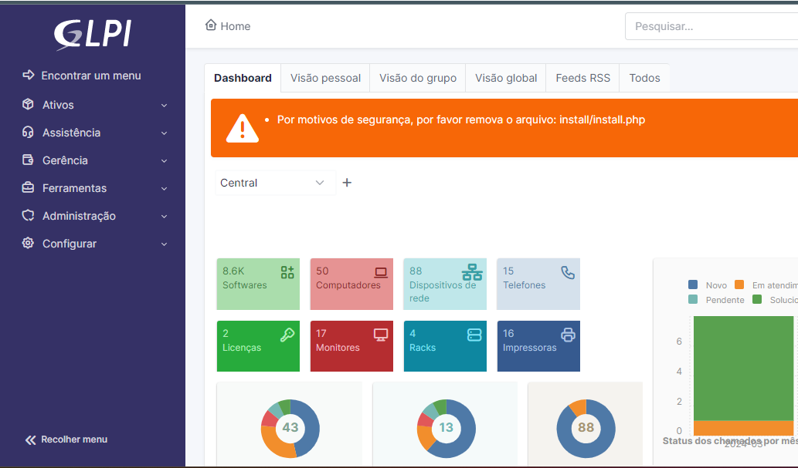

# Guia para Subir o GLPI no Google Cloud Platform (GCP) com Kubernetes

## Avisos Importantes Antes de Começar

1. **Faça backup dos arquivos importantes do GLPI:**
   - Baixe a versão mais recente do GLPI separadamente.
   - Copie as subpastas da pasta "files" do seu GLPI atual para a nova versão (HTML, TXT, XLSX, PNG, etc.), garantindo que todos os seus documentos estejam disponíveis na nova instalação.

2. **Realize o backup do banco de dados:**
   - Faça uma cópia do seu banco de dados antes de iniciar o processo com o seguinte comando:

     ```bash
     mysqldump -u root -p glpi > backup_glpi.sql
     ```

---

## Passo a Passo para Containerizar e Subir o GLPI no GCP

### 1. **Containerizar o GLPI**

#### Passo 1: Instalar Docker no Debian

Certifique-se de que o Docker esteja instalado na sua máquina Debian onde o GLPI está rodando:

```bash
sudo apt update
sudo apt install docker.io
```

#### Passo 2: Criar o Dockerfile

No diretório onde está o GLPI, crie um arquivo chamado `Dockerfile` com o seguinte conteúdo:

```Dockerfile
FROM debian:latest

# Instalar dependências necessárias
RUN apt-get update && apt-get install -y \
    apache2 \
    libapache2-mod-php \
    php-cli php-curl php-gd php-mbstring php-mysql php-xml php-zip php-intl php-ldap php-bz2 \
    wget unzip \
    && apt-get clean && rm -rf /var/lib/apt/lists/* 

# Copiar arquivos do GLPI para o container
COPY . /var/www/html/glpi/

# Configurar permissões
RUN chown -R www-data:www-data /var/www/html/glpi && \
    chmod -R 755 /var/www/html/glpi

# Configurar Apache
RUN touch /etc/apache2/conf-available/glpi.conf
RUN a2enmod rewrite
RUN echo '<VirtualHost *:80>\n\
        DocumentRoot /var/www/html/glpi/public\n\
        <Directory /var/www/html/glpi/public>\n\
            AllowOverride All\n\
            RewriteEngine On\n\
            RewriteCond %{REQUEST_FILENAME} !-f\n\
            RewriteRule ^(.*)$ index.php [QSA,L]\n\
        </Directory>\n\
    </VirtualHost>' > /etc/apache2/conf-available/glpi.conf
RUN a2enconf glpi.conf
RUN echo "ServerName localhost" >> /etc/apache2/apache2.conf

# Expor a porta 80
EXPOSE 80

# Inicializar o Apache
CMD ["apache2ctl", "-D", "FOREGROUND"]
```

#### Passo 3: Construir a Imagem Docker

No diretório **glpi** criado, copie o arquivo **Dockerfile** para essa pasta e execute o seguinte comando para construir a imagem:

```bash
sudo docker build -t <nome_para_sua_imagem> .

#No nosso exemplo considerer <nome_para_sua_imagem> como "glpi-container" nos demais passos desse arquivo.
```

#### Passo 4: Testar o Container Localmente

Execute o container localmente para garantir que está funcionando corretamente:

```bash
sudo docker run -d -p 8080:80 glpi-container
```

---

### 2. **Subir o GLPI no Google Cloud Platform (GCP)**

Aqui utilizaremos o **Google Kubernetes Engine (GKE)** na região `southamerica-east1`.

#### Passo 1: Push da Imagem para o Artifact Registry

Primeiro, faça o push da sua imagem Docker para o **Artifact Registry**:

1. **Autentique no GCP**:

   ```bash
    # Atualizar os pacotes
    sudo apt-get update && sudo apt-get install -y apt-transport-https ca-certificates gnupg

    # Adicionar a chave do repositório do Google Cloud
    echo "deb [signed-by=/usr/share/keyrings/cloud.google.gpg] https://packages.cloud.google.com/apt cloud-sdk main" | sudo tee -a /etc/apt/sources.list.d/google-cloud-sdk.list

    curl https://packages.cloud.google.com/apt/doc/apt-key.gpg | sudo apt-key --keyring /usr/share/keyrings/cloud.google.gpg add -

    # Atualizar os pacotes e instalar o Google Cloud SDK
    sudo apt-get update && sudo apt-get install -y  docker.io google-cloud-sdk
   ```

2. **Definindo projeto**:

   ```bash
   gcloud config set project <project_id>
   ```

3. **Tagueie a imagem**:

   ```bash
   docker tag glpi-container southamerica-east1-docker.pkg.dev/<project_id>/<repositorio>/<nome_imagem>
   ```

4. **Envie a imagem**:

   ```bash
   docker push southamerica-east1-docker.pkg.dev/<project_id>/<repositorio>/<nome_imagem>
   ```

#### Passo 2: Criar o Cluster GKE

Crie um cluster no Google Kubernetes Engine:

```bash
gcloud container clusters create glpi-cluster \
    --zone southamerica-east1-a
```

#### Passo 3: Configurar o Deployment no Kubernetes

Crie um arquivo `glpi-deployment.yaml` com o seguinte conteúdo:

```yaml
apiVersion: apps/v1
kind: Deployment
metadata:
  name: glpi-deployment
spec:
  replicas: 1
  selector:
    matchLabels:
      app: glpi
  template:
    metadata:
      labels:
        app: glpi
    spec:
      containers:
      - name: glpi
        image: southamerica-east1-docker.pkg.dev/<project_id>/<repositorio>/glpi-container
        ports:
        - containerPort: 80
```

Aplique o deployment no cluster:

```bash
kubectl apply -f glpi-deployment.yaml
```

#### Passo 4: Expor o Serviço

Crie um arquivo `glpi-service.yaml` para expor o serviço via LoadBalancer:

```yaml
apiVersion: v1
kind: Service
metadata:
  name: glpi-service
spec:
  type: LoadBalancer
  selector:
    app: glpi
  ports:
    - protocol: TCP
      port: 80
      targetPort: 80
```

Aplique o serviço:

```bash
kubectl apply -f glpi-service.yaml
```

Verificando se o serviço está rodando:

```bash
kubectl get services
```

---

### 3. **Configurar o Banco de Dados no GCP**

#### Passo 1: Criar uma Instância SQL no GCP

1. Crie um bucket no GCP e faça o upload do arquivo `backup_glpi.sql` (backup do seu banco de dados do glpi atual).
2. No GCP, crie uma instância SQL utilizando MySQL.
3. Crie um banco de dados chamado `glpi`.
4. No console SQL da Instância criada, crie um usuário e uma senha para o GLPI conectar ao banco de dados.

#### Passo 2: Importar o Backup do Banco de Dados

1. No Console SQL, clique em "Importar" na sua instância.
2. Aponte para o bucket onde o arquivo SQL foi enviado.
3. Defina o formato como SQL e selecione o banco de dados `glpi` como destino.


#### Passo 3: Conectar o GLPI ao Banco de Dados

1. No painel SQL, vá em "Conexões" e habilite o "IP público" ***(Nesse nosso caso de teste habilitamos o 0.0.0.0/0, em caso de produção, é importante verificar cada cenário para entender melhor a necessidade)***
2. Adicione o IP do seu cluster GKE nas "Redes Autorizadas".


#### Passo 4: Configurar o GLPI

1. Acesse o GLPI via navegador e selecione a opção de **Atualizar** (se for uma migração).
  -1.png>)
2. Insira as credenciais do banco de dados e selecione o banco de dados **glpi**, criado.
   
   

---

### Finalizando a Instalação

1. **Chave `glpicrypt.key`:** Faça o upload dessa chave em um bucket no GCP e faça o download no pod ativo do GLPI.
   
2. Para copiar essa chave ao seu pod do cluster, você pode se conectar ao seu terminal seguindo esses comandos: 
   1. verifique o nome do pod com o comando: **kubectl get pods**
   2. Realizar acesso remoto no terminal do pod: **kubectl exec -it <pod_name> -- /bin/bash**
   3. Com **wget** realize o download do arquivo **glpicrypt.key** ao definir o bucket como público e copiar o link de download do arquivo.
   4. Recorte o arquivo baixado na pasta: **/var/www/html/glpi/config**
3. **Remover `install.php`:** Acesse o container e remova o arquivo `install.php` para segurança.
   

Parabéns! Seu GLPI está configurado e rodando no GCP com sucesso!
